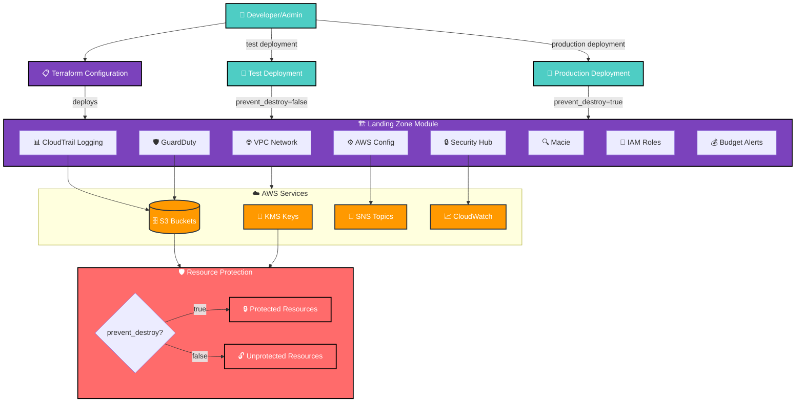
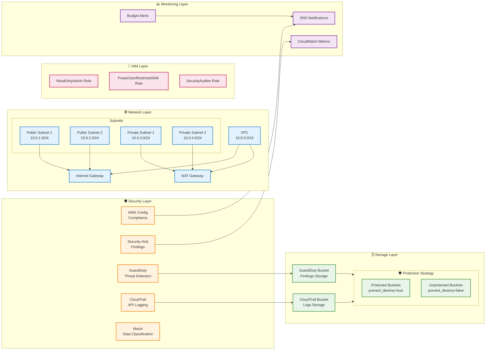

# Terraform AWS Secure Landing Zone - Architecture

## Overview

The Terraform AWS Secure Landing Zone provides a comprehensive foundation for AWS account security and compliance. This document outlines the architecture and design decisions.

## System Architecture Diagram



## Detailed Component Architecture



## Architecture Components

### 1. Networking Layer

```
┌─────────────────────────────────────────────────────────────┐
│                    VPC (10.0.0.0/16)                      │
├─────────────────────────────────────────────────────────────┤
│  Public Subnets (2 AZs)     │  Private Subnets (2 AZs)   │
│  • 10.0.1.0/24 (us-east-1a)│  • 10.0.3.0/24 (us-east-1a)│
│  • 10.0.2.0/24 (us-east-1b)│  • 10.0.4.0/24 (us-east-1b)│
├─────────────────────────────────────────────────────────────┤
│  Internet Gateway           │  NAT Gateway                │
│  • Public Internet Access   │  • Private Subnet Access    │
└─────────────────────────────────────────────────────────────┘
```

### 2. Security & Monitoring Layer

```
┌─────────────────────────────────────────────────────────────┐
│                    Security Services                       │
├─────────────────────────────────────────────────────────────┤
│  CloudTrail                │  AWS Config                  │
│  • API Logging             │  • Compliance Monitoring     │
│  • S3 Storage              │  • Managed Rules             │
│  • KMS Encryption          │  • Configuration History     │
├─────────────────────────────────────────────────────────────┤
│  GuardDuty                 │  Security Hub                │
│  • Threat Detection        │  • Centralized Findings      │
│  • S3 Malware Protection   │  • Compliance Standards      │
│  • EBS Volume Scanning     │  • Automated Response        │
└─────────────────────────────────────────────────────────────┘
```

### 3. Data Protection Layer

```
┌─────────────────────────────────────────────────────────────┐
│                    Data Protection                         │
├─────────────────────────────────────────────────────────────┤
│  Macie                     │  S3 Block Public Access      │
│  • Data Classification     │  • Public Access Blocking    │
│  • PII Detection          │  • Bucket Policies           │
│  • Custom Identifiers     │  • Lifecycle Management      │
└─────────────────────────────────────────────────────────────┘
```

### 4. Resource Protection Layer

```
┌─────────────────────────────────────────────────────────────┐
│                    Resource Protection                     │
├─────────────────────────────────────────────────────────────┤
│  Configurable Protection   │  Dual-Bucket Approach        │
│  • prevent_destroy = true │  • Protected Buckets         │
│  • Production Safety      │  • Unprotected Buckets       │
│  • Test Flexibility       │  • Conditional Creation       │
└─────────────────────────────────────────────────────────────┘
```

**Resource Protection Strategy:**
- **Production Environment**: `prevent_destroy = true` (default)
  - Protects critical resources from accidental deletion
  - S3 buckets with `lifecycle.prevent_destroy = true`
  - KMS keys with deletion protection
- **Test Environment**: `prevent_destroy = false`
  - Allows complete cleanup for testing
  - Enables automated resource destruction
  - Supports CI/CD pipeline testing
- **Dual-Bucket Implementation**:
  - Conditional resource creation using `count` parameter
  - `*_protected` buckets with lifecycle protection
  - `*_unprotected` buckets without protection
  - Local references for consistent resource selection

### 4. Identity & Access Management

```
┌─────────────────────────────────────────────────────────────┐
│                    IAM Framework                           │
├─────────────────────────────────────────────────────────────┤
│  Baseline Roles            │  Permission Boundaries       │
│  • ReadOnlyAdmin           │  • Maximum Permissions       │
│  • PowerUserRestrictedIAM  │  • Policy Enforcement        │
│  • SecurityAuditor         │  • Compliance Controls       │
└─────────────────────────────────────────────────────────────┘
```

### 5. Cost Management

```
┌─────────────────────────────────────────────────────────────┐
│                    Cost Management                         │
├─────────────────────────────────────────────────────────────┤
│  AWS Budgets               │  SNS Notifications           │
│  • Cost Thresholds         │  • Email Alerts              │
│  • Automated Actions       │  • Slack Integration         │
│  • Forecast Monitoring     │  • Escalation Procedures     │
└─────────────────────────────────────────────────────────────┘
```